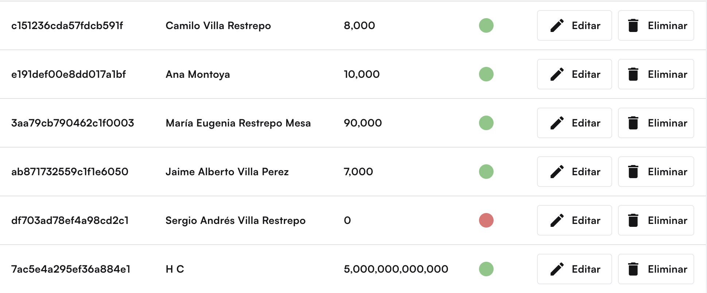
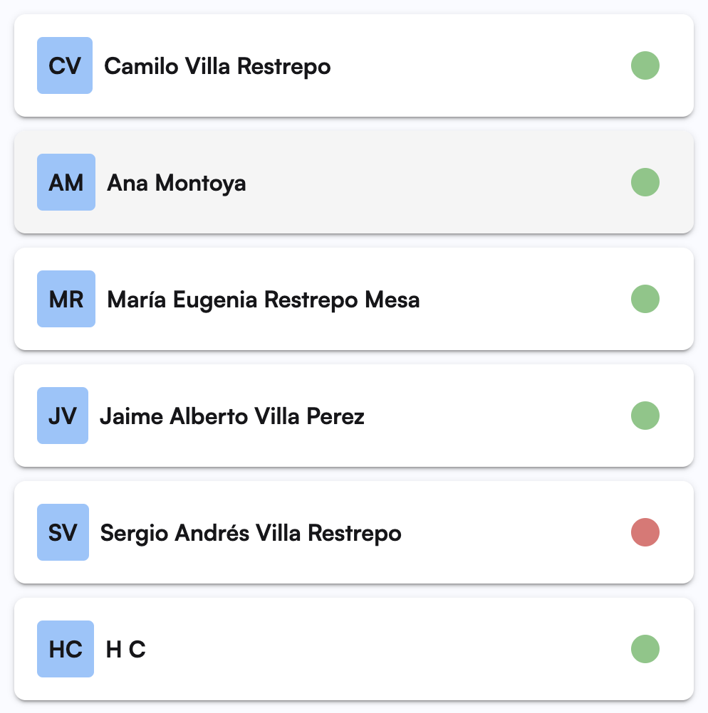

# Web components usando Stenciljs

Como bonus del proyecto, decidí añadir un componente utilizando Stenciljs, este componente sirve para determinar el estado de un usuario, es decir, si está activo o no.

Este componente recibe un boolean donde si es _true_ el componente se torna verde y si es _false_ el componente se muestra rojo.

Posteriormente, la aplicación fue publicada en npm, la puedes descargar y hacer uso de ella aquí: [librería npm](https://www.npmjs.com/package/leal-components)
